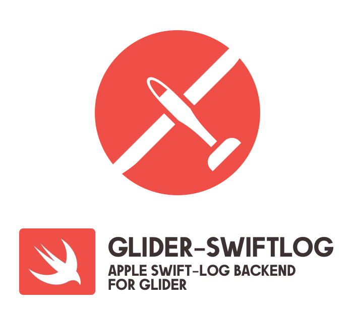

<p align="center">
<picture>
  <source media="(prefers-color-scheme: dark)" srcset="./Documentation/assets/glider-swiftlog-dark.png" width="350">
  
</picture>
</p>

[](https://img.shields.io/badge/Swift-5.1_5.3_5.4_5.5_5.6_5.7-Orange?style=flat-square)
[](#installation)
[](https://img.shields.io/badge/Swift_Package_Manager-compatible-orange?style=flat-square)
[](https://img.shields.io/cocoapods/v/GliderLogger.svg)

# Glider

**Glider is the logger for just about everything!**

It's designed to be:
- **SIMPLE**: with a modular & extensible architecture, fully documented
- **PERFORMANT**: you can use Glider without the worry of impacting your app performances
- **UNIVERSAL**: it supports 14+ transports to satisfy every need; you can create your transport too!

See the [project's page on GitHub for more informations](https://github.com/immobiliare/Glider).

# Glider-SwiftLog

Glider can also work as a backend for [apple/swift-log](https://github.com/apple/swift-log/).  

The `GliderSwiftLogHandler` offers a `LogHandler` object which you can assign to the swift-log settings to use Glider as the backend:

```swift
LoggingSystem.bootstrap {
    var handler = GliderSwiftLogHandler(label: loggerName, logger: gliderLogger)
    handler.logLevel = .trace
    return handler
}
```

# Install

This package require the Core Library of Glider you [can found here](https://github.com/immobiliare/Glider).  
Package is distributed both as CocoaPods dependency and SPM dependency.

## Swift Package Manager

The Swift Package Manager is a tool for automating the distribution of Swift code and is integrated into the swift compiler. It is in early development, but Glider does support its use on supported platforms.

Once you have your Swift package set up, adding Glider as a dependency is as easy as adding it to the dependencies value of your `Package.swift`.

```swift
dependencies: [
    .package(url: "https://github.com/immobiliare/Glider-AppleSwiftLog.git")
]
```

Manifest also includes third-party packages for other transports, like ELK or Sentry.  
The Glider core SDK is the `Glider` package.

## Requirements

Minimum requirements are:
- Swift 5.1
- iOS 11+, macOS 10.14+, tvOS 12.0+
- Sentry SDK 7+